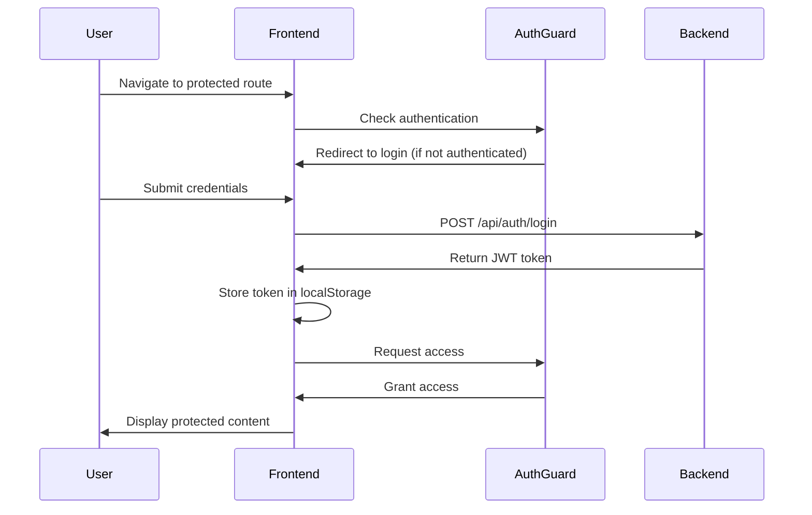

<div align="center">

# SupplyChainIX Frontend

### Modern Supply Chain Management Interface

[](https://angular.io/)
[](https://www.typescriptlang.org/)
[](https://tailwindcss.com/)
[](https://rxjs.dev/)

**[Backend Repository](https://github.com/mustapha-moutaki/supplyChainIX)** • **[Live Demo](#)** • **[Documentation](#)**

</div>

---

## >> Overview

**SupplyChainIX Frontend** is a cutting-edge Angular application that provides an intuitive, responsive interface for comprehensive supply chain management. Built with enterprise-grade architecture, it seamlessly integrates with a Spring Boot backend to deliver real-time supply chain insights and operations management.

### [+] Key Highlights

- **Modern UI/UX** - Clean, responsive design powered by Tailwind CSS
- **Secure Authentication** - JWT-based auth with role-based access control
- **Real-Time Dashboards** - Dynamic widgets and production insights
- **Scalable Architecture** - Feature-based modular structure
- **Optimized Performance** - Lazy loading and efficient state management
- **Reactive Programming** - Leveraging RxJS for seamless data flow

---

## <> Features

### [~] Supply Chain Management

<table>
<tr>
<td width="50%">

#### [#] Supplier Management
- Comprehensive supplier directory
- Modal-based supplier creation
- Advanced pagination & filtering
- Supplier performance tracking

</td>
<td width="50%">

#### [#] Raw Material Management
- Complete CRUD operations
- Real-time stock monitoring
- Inventory level alerts
- Material tracking & tracing

</td>
</tr>
<tr>
<td width="50%">

#### [#] Product Management
- Product catalog management
- Multi-variant support
- Production status tracking
- Quality control integration

</td>
<td width="50%">

#### [#] Production Workflows
- Production planning dashboard
- Resource allocation
- Progress monitoring
- Performance analytics

</td>
</tr>
</table>

### [!] Security & Authentication

- **JWT Token Management** - Secure token-based authentication
- **HTTP Interceptors** - Automatic token attachment to requests
- **Route Guards** - Role-based access control (RBAC)
- **Protected Routes** - Admin, Manager, and User-specific pages
- **Session Management** - Auto-refresh and secure logout

### [*] Dashboards & Analytics

- **Admin Dashboard** - System-wide metrics and controls
- **Production Dashboard** - Real-time production insights
- **Custom Widgets** - Configurable data visualizations
- **Export Capabilities** - Data export and reporting

---

## </> Technology Stack

| Technology | Purpose | Version |
|------------|---------|---------|
| **Angular** | Frontend Framework | 18+ |
| **TypeScript** | Type-safe Development | 5.0+ |
| **Tailwind CSS** | Utility-first Styling | 3.0+ |
| **RxJS** | Reactive Programming | 7.0+ |
| **Angular Router** | Navigation & Lazy Loading | Latest |
| **HTTP Client** | API Communication | Latest |

---

## {:} Project Architecture

```
src/
├── app/
│   ├── api/                          # API endpoint definitions
│   │   ├── endpoints.ts
│   │   └── api.config.ts
│   │
│   ├── core/                         # Core application modules
│   │   ├── guards/                   # Route protection
│   │   │   ├── auth.guard.ts
│   │   │   ├── role.guard.ts
│   │   │   └── admin.guard.ts
│   │   │
│   │   ├── interceptors/             # HTTP interceptors
│   │   │   ├── auth.interceptor.ts
│   │   │   ├── error.interceptor.ts
│   │   │   └── loading.interceptor.ts
│   │   │
│   │   ├── layout/                   # Layout components
│   │   │   ├── main-layout/
│   │   │   └── auth-layout/
│   │   │
│   │   ├── models/                   # TypeScript interfaces & DTOs
│   │   │   ├── supplier.model.ts
│   │   │   ├── product.model.ts
│   │   │   ├── raw-material.model.ts
│   │   │   └── user.model.ts
│   │   │
│   │   └── service/                  # Core business services
│   │       ├── auth.service.ts
│   │       ├── storage.service.ts
│   │       └── notification.service.ts
│   │
│   ├── features/                     # Feature modules (lazy-loaded)
│   │   ├── admin/                    # Admin panel
│   │   ├── auth/                     # Authentication pages
│   │   │   ├── login/
│   │   │   └── register/
│   │   ├── dashboard/                # Main dashboards
│   │   ├── product/                  # Product management
│   │   ├── production/               # Production workflows
│   │   ├── raw-material/             # Material inventory
│   │   ├── supplier/                 # Supplier management
│   │   └── welcome/                  # Landing page
│   │
│   ├── shared/                       # Shared components & utilities
│   │   ├── components/
│   │   ├── directives/
│   │   ├── pipes/
│   │   └── utils/
│   │
│   └── app.routes.ts                 # Application routing
│
├── environments/                      # Environment configs
│   ├── environment.ts
│   └── environment.development.ts
│
├── assets/                           # Static assets
│   ├── images/
│   ├── icons/
│   └── fonts/
│
└── styles.css                        # Global styles
```

### [^] Architecture Principles

- **Feature-Based Structure** - Organized by business domains
- **Lazy Loading** - Improved initial load performance
- **Separation of Concerns** - Clear boundaries between layers
- **Dependency Injection** - Loosely coupled, testable code
- **Reactive Patterns** - Observable-based data flow

---

## >> Getting Started

### [?] Prerequisites

Ensure you have the following installed:

- **Node.js** (v18 or higher) - [Download](https://nodejs.org/)
- **npm** (v9 or higher) - Comes with Node.js
- **Angular CLI** - `npm install -g @angular/cli`
- **Git** - [Download](https://git-scm.com/)

### [+] Installation

1. **Clone the repository**
   ```bash
   git clone https://github.com/mustapha-moutaki/mustapha-moutaki-supplychainix-front.git
   cd mustapha-moutaki-supplychainix-front
   ```

2. **Install dependencies**
   ```bash
   npm install
   ```

3. **Configure environment**
   
   Update `src/environments/environment.development.ts`:
   ```typescript
   export const environment = {
     production: false,
     apiUrl: 'http://localhost:8080/api'
   };
   ```

4. **Start development server**
   ```bash
   ng serve
   # or
   npm start
   ```

5. **Open in browser**
   
   Navigate to `http://localhost:4200`

### [<=>] Backend Setup

This frontend requires the SupplyChainIX backend to be running:

1. Clone the backend repository:
   ```bash
   git clone https://github.com/mustapha-moutaki/supplyChainIX.git
   ```

2. Follow backend setup instructions

3. Ensure backend is running on `http://localhost:8080`

---

## [~] Configuration

### [>>] Proxy Configuration

Development proxy is configured in `proxy.conf.json` to avoid CORS issues:

```json
{
  "/api": {
    "target": "http://localhost:8080",
    "secure": false,
    "changeOrigin": true,
    "logLevel": "debug"
  }
}
```

### [ENV] Environment Variables

| Variable | Development | Production |
|----------|-------------|------------|
| `apiUrl` | `http://localhost:8080/api` | Your production API URL |
| `production` | `false` | `true` |

---

## [T] Testing

### Run Unit Tests
```bash
ng test
```

### Run E2E Tests
```bash
ng e2e
```

### Code Coverage
```bash
ng test --code-coverage
```

Coverage reports are generated in `coverage/` directory.

---

## [=] Building for Production

### Create Production Build
```bash
ng build --configuration production
```

### Build Output
- Output directory: `dist/`
- Optimized, minified, and ready for deployment
- Includes AOT compilation and tree-shaking

### Deployment Options
- **Static Hosting**: Netlify, Vercel, GitHub Pages
- **CDN**: AWS S3 + CloudFront, Azure Static Web Apps
- **Container**: Docker with Nginx

---

## [!] Authentication Flow



---

## [API] API Integration

### Base URL
```typescript
const API_BASE_URL = 'http://localhost:8080/api';
```

### Key Endpoints

| Endpoint | Method | Description |
|----------|--------|-------------|
| `/auth/login` | POST | User authentication |
| `/auth/register` | POST | User registration |
| `/suppliers` | GET | List all suppliers |
| `/suppliers` | POST | Create new supplier |
| `/raw-materials` | GET | List materials |
| `/products` | GET | List products |
| `/production/dashboard` | GET | Production metrics |

### Service Example

```typescript
@Injectable({ providedIn: 'root' })
export class SupplierService {
  private apiUrl = `${environment.apiUrl}/suppliers`;

  constructor(private http: HttpClient) {}

  getSuppliers(page: number = 0, size: number = 10): Observable<SupplierPage> {
    return this.http.get<SupplierPage>(`${this.apiUrl}?page=${page}&size=${size}`);
  }

  createSupplier(supplier: Supplier): Observable<Supplier> {
    return this.http.post<Supplier>(this.apiUrl, supplier);
  }
}
```

---

## [CSS] Styling Guidelines

### Tailwind CSS Usage

The project uses Tailwind CSS for consistent, utility-first styling:

```html
<div class="container mx-auto px-4 py-8">
  <h1 class="text-3xl font-bold text-gray-800 mb-6">Dashboard</h1>
  <div class="grid grid-cols-1 md:grid-cols-3 gap-6">
    <!-- Cards -->
  </div>
</div>
```

### Custom Theme
- Primary Color: `#DD0031` (Angular Red)
- Secondary Color: `#3178C6` (TypeScript Blue)
- Accent: `#06B6D4` (Tailwind Cyan)

---

## [&] Contributing

Contributions are welcome! Please follow these steps:

1. Fork the repository
2. Create a feature branch (`git checkout -b feature/amazing-feature`)
3. Commit your changes (`git commit -m 'Add amazing feature'`)
4. Push to the branch (`git push origin feature/amazing-feature`)
5. Open a Pull Request

### Code Standards
- Follow Angular style guide
- Write meaningful commit messages
- Add unit tests for new features
- Update documentation as needed

---

## [©] License

This project is licensed under the MIT License - see the [LICENSE](LICENSE) file for details.

---

## [@] Author

<div align="center">

### **Mustapha Moutaki**

Full-Stack Developer | Angular & Spring Boot Specialist

[](https://github.com/mustapha-moutaki)
[](https://www.linkedin.com/in/mustapha-moutaki-6528a2242/)
[](https://mustapha-portfolio-d10muxzta-mustapha-moutakis-projects.vercel.app/)

*Passionate about building scalable enterprise applications with clean architecture and modern technologies.*

</div>

---

## [++] Acknowledgments

- Angular Team for the amazing framework
- Tailwind CSS for the utility-first approach
- Spring Boot community for backend best practices
- All contributors and supporters

---

<div align="center">

### [*] Star this repository if you find it helpful!

**[Report Bug](https://github.com/mustapha-moutaki/mustapha-moutaki-supplychainix-front/issues)** • **[Request Feature](https://github.com/mustapha-moutaki/mustapha-moutaki-supplychainix-front/issues)**

Made with code by Mustapha Moutaki

</div>